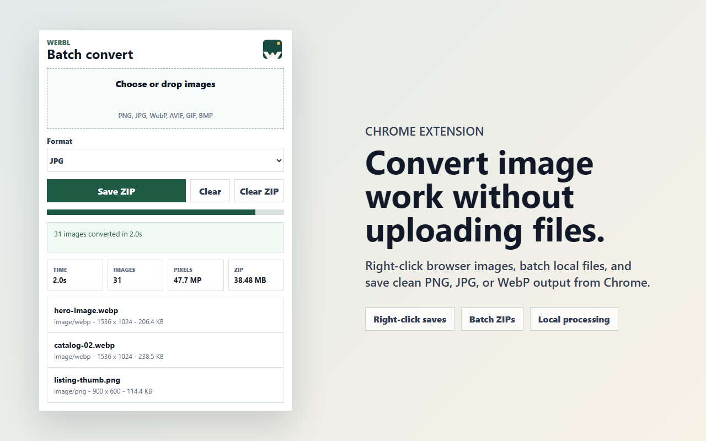

# Werbl

Werbl is a local-first Chrome extension for converting browser images and local
image batches to PNG, JPG, or WebP.

The core promise is simple: **convert images in Chrome without uploading them to
a Werbl-controlled server.**



## Features

- Right-click browser images and save them as PNG, JPG, or WebP.
- Batch local image files into one downloadable ZIP.
- Convert with browser-native image APIs.
- Save downloads to the user's default Chrome download directory.
- Preserve a completed ZIP so a canceled save dialog can be retried without
  reconverting the batch.
- Use a dedicated extension window for longer batch work.
- Show conversion progress, elapsed time, image count, processed megapixels, and
  generated ZIP size.
- Store JPG/WebP quality as a global setting used by both batch conversion and
  right-click saves.

## Privacy And Trust

Werbl has no backend service. Image conversion happens locally in Chrome using
browser APIs such as `createImageBitmap`, canvas, `toBlob`, and `toDataURL`.

Werbl does not upload images, selected files, generated ZIP files, image URLs,
conversion settings, or conversion history to a Werbl-controlled server.

See [docs/privacy-policy.md](docs/privacy-policy.md) for the full privacy
policy.

## Current Limits

- Some sites block browser-based image reading or canvas conversion.
- Protected, expiring, cross-origin, or script-generated image URLs may fail.
- Closing the toolbar popup during an active batch cancels that batch. Use the
  `Window` button for longer work.
- Output is intentionally limited to PNG, JPG, and WebP.

## Install For Development

```powershell
npm install
npm run setup:smoke
```

Load the extension manually:

1. Open `chrome://extensions`.
2. Enable **Developer mode**.
3. Click **Load unpacked**.
4. Select the `extension` folder in this repository.

## Development

Run the local web workspace:

```powershell
npm run dev
```

Run the full validation suite:

```powershell
npm run check
```

`npm run check` validates extension JavaScript syntax, builds the Vite app, runs
linting, and executes a Chromium smoke test for the extension popup and ZIP
workflow.

## Package The Extension

```powershell
npm run assets:store
npm run package:extension
```

The Chrome Web Store upload ZIP is written to:

```text
artifacts\werbl-extension.zip
```

The package script includes only runtime extension files.

## Repository Layout

```text
extension/                         Chrome MV3 extension
src/                               Local Vite/React workspace
scripts/                           Packaging, smoke, and asset scripts
brand/                             Werbl icons and store listing images
docs/privacy-policy.md             Public privacy policy source
```

## Security

Please do not report security issues in public GitHub issues. See
[SECURITY.md](SECURITY.md) for private reporting instructions.

## License

Werbl is released under the [MIT License](LICENSE).
